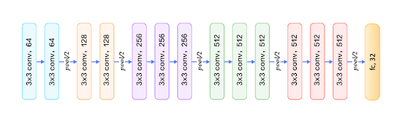

## Cancer Diagnosis using Convolutional Neural Networks (CNNs)

### Objective

The objective of this exercise is to build a convolutional neural network than can accurately diagnose breast cancer from mammograms.

### Dataset

For this project, we use the Digital Database for Screening Mammography (DDSM) data set, which is a collection of labelled mammographic images maintained for use by the research community. The data set contains 2,620 cases of patients and mammograms with calcifications, masses, and
non-pathological findings labelled on a scale of 1-5 according to the BI-RADS scheme.

### Model

We trained five baseline models for the image classification task, including VGG16, ResNet50, and MobileNet using EC2 instance on Amazon AWS. Based on performance on the validation set, we choose VGG16, pre-trained on ImageNet, as the best performing model.

### Results

The model we chose produced an accuracy of 86.9% on the test set and an AUC of 0.933, which met our performance benchmarks.

